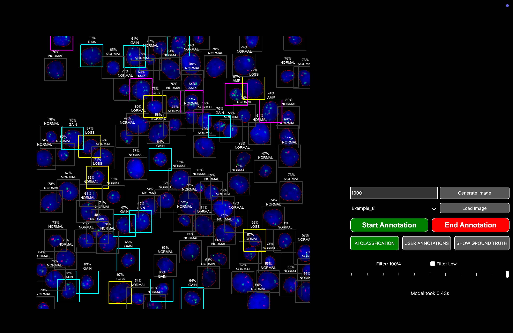

# TEDxAI-2025



This repository is part of the **St. Anna Children's Cancer Research Institute's** contribution to the [TEDxAI](https://tedai-vienna.ted.com).

It features an **interactive game** that simulates the process of detecting **genetic aberrations in microscopic images**, a critical task in medical diagnostics. The game highlights the challenges of **manual image evaluation**, emphasizing that human analysis is **time-consuming and error-prone**. It also demonstrates how **AI can significantly improve this process**, offering **faster and more reliable** results in many scenarios.

⚠️ **Note:** The GUI has only been tested on **Linux and macOS**. Windows users may experience compatibility issues.

---

## 🛠 Installation

1. **Clone this repository:**
   ```bash
   git clone https://github.com/SimonBon/TEDxAI_2025
   cd TEDxAI_2025
   ```

2. **Create the Conda environment and activate it:**
   If you do not have conda installed, please refer to the [Anaconda](https://www.anaconda.com/download) webpage to install it.
   ```bash
   conda env create -f environment.yml
   conda activate TEDxAI
   ```

3. **Download the model, Cellpose weights, synthetic-cell bank, and example TIFFs from Zenodo:**
   ```bash
   python GUI/zenodo_utils.py -o .
   ```
   This populates the repository root with `model_new.pth`, `config_new.py`, `small_data.h5`, `CP_TU_MORE/`, and `real_images/`.

4. **Start the application:**
   ```bash
   python GUI/app.py
   ```

🎉 **You're all set! Enjoy the game!**

---

## 🔬 Background

The game displays **synthetic microscopic images** where individual cells are placed on a black background, ensuring that they do not overlap.

The AI model operates in **two key stages**:

1. **Feature Extraction (Embedding Stage)**
   - The model analyzes an image of a **single cell** and embeds it into a **high-dimensional space**.
   - You can think of this as **describing a cell in words** — similar-looking cells receive similar descriptions.
   - Instead of words, however, the model uses **numerical representations** to categorize cells efficiently.

2. **Classification Stage**
   - The **embedded cell representation** is fed into a **classifier** that determines whether the cell is **tumorous or healthy**.
   - This process is repeated for every cell in the image, allowing the system to **automatically detect** all tumor and healthy cells.

⚡ **Challenge:** Do you think you are faster and more accurate than the AI? **Prove it!**

---

📢 **Feedback & Contributions**
If you encounter any issues or have suggestions, feel free to open an **issue** or contribute to the repository.

🔗 **Contact:** [Simon Gutwein](mailto:simon.gutwein@ccri.at)

🚀 **Enjoy exploring AI-powered diagnostics!**
